# 🌐 Secure Inter-Region AWS VPC Peering Architecture

A production-grade cloud networking project demonstrating the implementation of **Inter-Region VPC Peering** across two distinct geographic AWS locations: Mumbai (`ap-south-1`) and North Virginia (`us-east-1`). This design implements a secure, private communication pipeline allowing workloads to route traffic natively over the AWS global network backbone using private IP addresses alone, completely bypassing the public internet.

---

## 🗺️ Architectural Topology

The diagram below illustrates the multi-region topology, subnet segmentations, internet gateways, and explicit route definitions established to achieve secure cross-region routing:

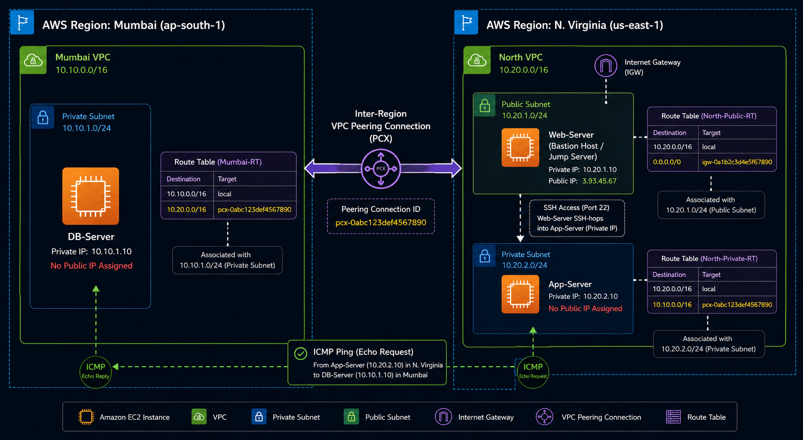

---

## 🛠️ Infrastructure Component Layout

### 🇮🇳 1. Mumbai Region (`ap-south-1`) Workspace
* **VPC:** `Mumbai vpc`
* **Subnet:** Isolated Private Subnet
* **Compute Instance:** `db-server` (Hosting backend relational workflows. Configured with a Private IP address only; no public gateway interface attached).
* **Security Control:** Stateful security firewall rule explicitly permitting **Inbound ICMP** echoes originating from the North Virginia private network segment.

### 🇺🇸 2. N. Virginia Region (`us-east-1`) Workspace
* **VPC:** `north vpc`
* **Subnet Layout:**
  * **Public Subnet:** Outbound route mapped through an Internet Gateway (`n_igw.png`). Hosts the `web-server` instance.
  * **Private Subnet:** Mapped to isolated localized routing tables. Hosts the `app-server` instance.
* **Compute Instances:**
  * `web-server`: Acts as a secure, hardened **Bastion Host / Jump Server** to broker remote management connectivity.
  * `app-server`: Processing core application layers (Private IP address only).

---

## 🚀 Step-by-Step Deployment Playbook

### Step 1: Provision the Custom Mumbai VPC Infrastructure
A dedicated cloud network space named `Mumbai-vpc` was provisioned to host database infrastructure.

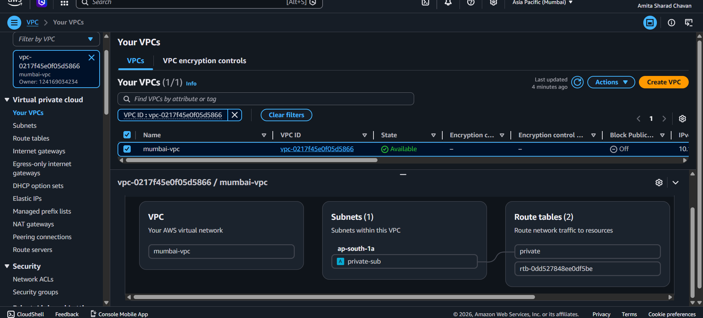

### Step 2: Configure Mumbai Private Subnets and Dedicated Route Tables
An isolated subnet segment was structuralized and bound to a fresh, independent route table to ensure strict boundary segregation from default infrastructure rules.

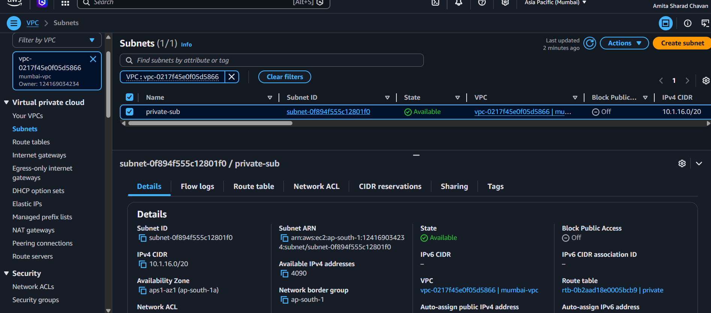
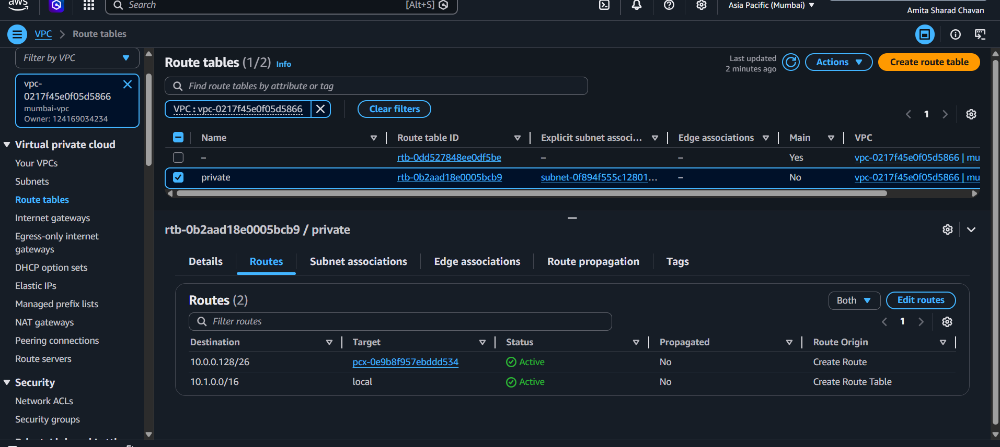
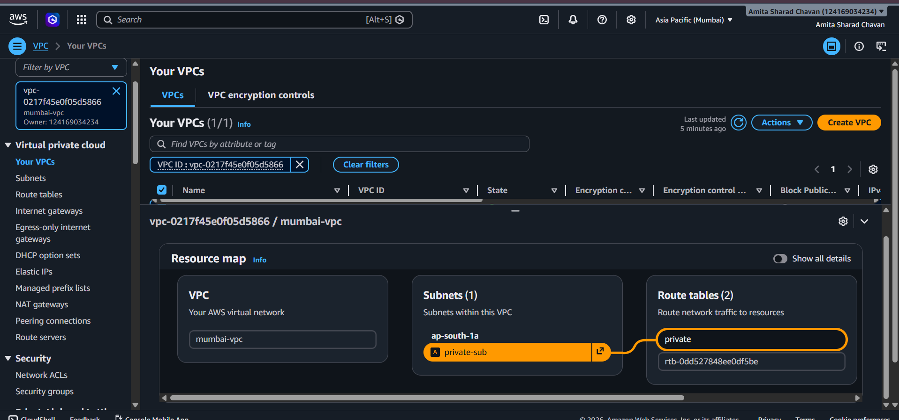

### Step 3: Deploy the Isolated DB-Server Compute Node
The `db-server` instance was deployed inside the custom subnet. A verification check confirms that no public IP addresses were leaked or assigned to the machine interface.

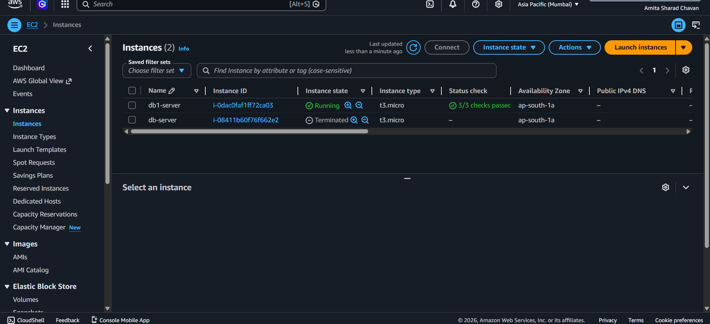
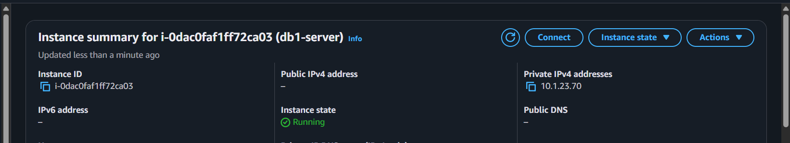

### Step 4: Configure Database Stateful Security Groups
Security group inbound parameters were modified to allow stateful network testing using ICMP packet verification checks.

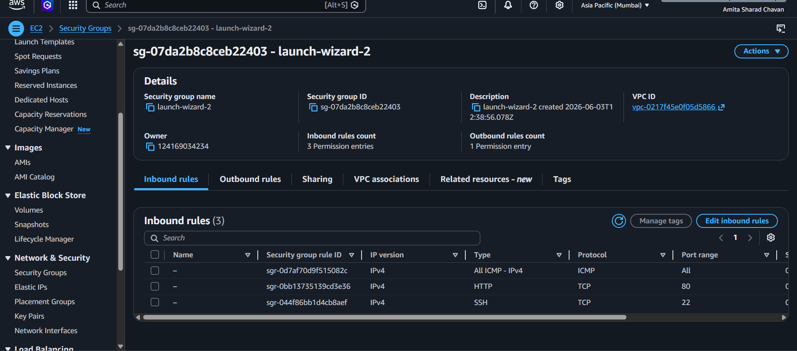

### Step 5: Provision the North Virginia Core VPC Space
Switching regional scopes to `us-east-1`, a secondary isolated workspace network named `north_vpc` was built.

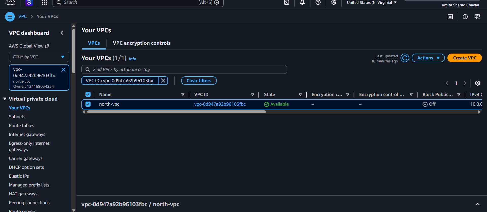

### Step 6: Segment Public and Private Subnet Layouts
Subnet scopes were defined within the new VPC domain to segregate public-facing access nodes from deep-tier compute modules.

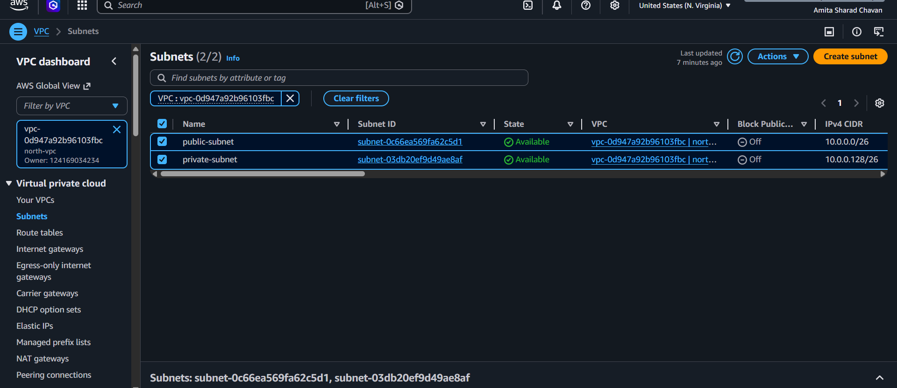

### Step 7: Attach and Associate the Public Internet Gateway
An Internet Gateway was attached to the VPC framework and linked explicitly via the public route tables to allow external internet connectivity into the public subnet boundary.

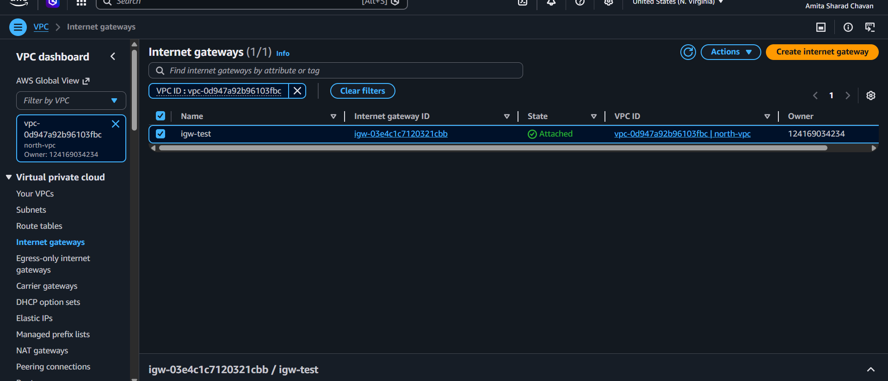

*(Note: Corresponding network interfaces, route associations, and subnet alignments for North Virginia are validated across `n_private_rt.png`, `n_p_rt.png`, and `n_subnet_association.png` configurations).*

### Step 8: Initialize Inter-Region VPC Peering Connection
A peering request was initiated from the North Virginia network core (`n_pc.png`), targeting the specific resource identifier of the Mumbai VPC core. The cross-region handshake was officially verified and accepted back in the Mumbai dashboard interface.

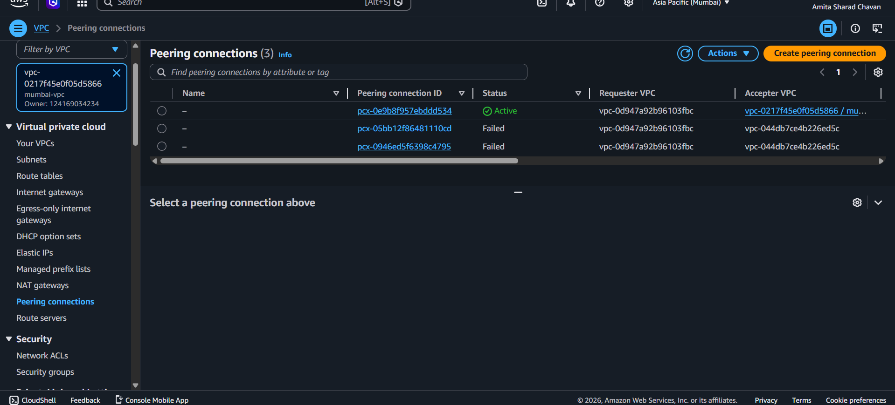

### Step 9: Establish Asymmetric Routing Tables
To make the peering connection route traffic, explicit static network entries were written into both regional route tables. Subnet traffic bound for the corresponding region's private IP CIDR ranges was explicitly configured to hop directly into the Peering Connection target ID (`pcx-xxxx`).

### Step 10: Execute Cross-Region Connectivity Validation Handshake
1. A secure connection from the local workstation was tunneled directly into the `web-server` (Bastion Host) in North Virginia utilizing its public facing interface.
2. The private cryptographic keys were passed to the Bastion host via a secure copy command (`scp`).
3. An internal SSH jump was initiated from the `web-server` straight into the private IP space of the backend `app-server`.
4. From the command line of the `app-server` in North Virginia, a network diagnostic ping test was fired directly at the private IP address of the `db-server` physically sitting inside the Mumbai data centers.

The network traffic successfully transited the AWS global fiber mesh without using public IP gateways, returning clean, zero-loss ICMP transaction signals.

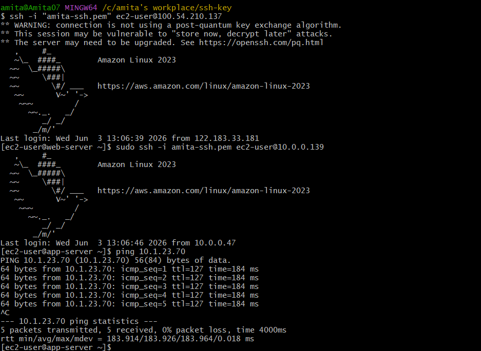

---

## 🎯 Key Cloud Engineering Takeaways
* **Bastion Host Security Architecture:** Eliminated brute-force threat vulnerabilities on high-value backend infrastructure elements by stripping public IP interfaces completely and relying entirely on secure internal transit jumps.
* **Asymmetric Network Route Targeting:** Demonstrated deep comprehension of network routing table modifications across completely different global deployment frameworks to maintain persistent routing channels.
* **Global Network Optimization:** Utilized standard native AWS peering capabilities to drastically reduce network data transport latency compared to traditional internet VPN setups.